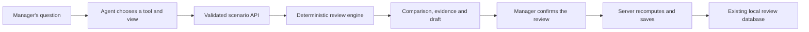

# UN: deterministic review, flexible investigation

September 12, 2026. Incorporates the project's task history, current source code, and the user's request for a practical ten-minute architecture slice.

**What changed across the project.**

| Project history reviewed | Contribution visible in the current project |
| --- | --- |
| Review real estate agent workflow | Established the property-manager user, vacancy and maintenance handoffs, existing-product suggestions, and the operations review/save flow. |
| Implement rent control workflow | Added manager/property intake and unit-specific proposals grounded in supplied correspondence. Inbox connection remained a future step. |
| Investigate rent control solutions | Compared LA-focused products, narrowed the showcase to renewal preparation, and implemented UN's fictional portfolio, deterministic review engine, internal drafts and local review database. |
| Review genius idea integration | Connected deep investigation with retaining supported resolutions. The [bus ticket review](bus-ticket-product-review.md) proposes the complete evidence-resolution loop. |

Git history still primarily describes the inherited starter. The new product work is in the current working tree, so both task history and source inspection were needed to reconstruct the direction.

**Are we different?** The current project is materially more specific than its original workflow advisor: it evaluates unit records and produces reviewable outcomes. That is product progress, but uniqueness remains unproven. RentRight advertises property-specific rule evaluation, renewal triage and source trails. LandlordOS advertises notices, action workflows and proof records and labels its offering a prototype pending legal review. These are vendor descriptions, not independent validations. [RentRight](https://rentright.io/for-property-managers), [LandlordOS](https://landlordos.net/), checked September 12, 2026.

The prospective distinction is helping a manager move through scattered, contradictory evidence, choose the next investigation, and carry supported resolutions forward. A calculation engine plus chat is a common architecture; it does not establish that distinction on its own. Connected record intake and persistent evidence correction remain necessary future work.

**The split we already had.** [un-review.ts](../apps/web/src/lib/un-review.ts) is deterministic: given the same unit, simulation date and preferences it computes the same checks and draft. The existing desk invokes it locally, while [un-reviews.ts](../apps/web/src/lib/server/un-reviews.ts) independently recomputes on save and persists the full packet. The assistant originally only opened existing reviews and explained their supplied content.

**The implemented slice.** Open [the investigation workspace](http://127.0.0.1:3100/agent), also linked from the homepage sidebar.

The [scenario service](../apps/web/src/lib/server/un-workbench.ts) accepts only an existing unit ID, simulation date and bounded preferences. It loads facts and rules on the server and returns baseline and hypothetical results plus their differences. It rejects client-authored evidence, caps, calculated packets and statuses. Scenario calls do not change the seed portfolio or save data.

The [agent workspace](../apps/web/src/components/un-workbench.tsx) gives the assistant four tools: inspect a unit, preview a scenario, choose a result view, and prepare a review for the manager. The model controls the investigation order and explanation; the displayed arithmetic, blockers, sources and draft come from the backend. A [dedicated prompt](../apps/web/src/lib/un-workbench-prompt.ts) and runtime keep these capabilities scoped to the new surface.

The manager can use the same operations through guided buttons and editable controls when conversation is unavailable. Save still uses the existing explicit confirmation flow and server storage; an agent tool cannot call the save handler. Saved scenarios are internal review packets and do not apply preferences to the portfolio or alter ledger rent.

**Demonstration.**

1. Choose “What changes at 4%?” The backend compares Unit 04 against the 2% baseline and holds the hypothetical proposal under the existing fixture's rule.
2. Choose “Why is Unit 12 held?” Both conflicting records remain visible, with a specific evidence task.
3. Try Unit 12 at a 60-day planning window and inspect the changed review state. Unit 04 remains due because its lease ends in 30 days.
4. Open Review & save, inspect the scenario and either cancel or confirm. After confirming, use Saved reviews on the homepage to retrieve the same local packet.

With a configured model, ask those questions conversationally and verify that the corresponding tools run. Guided mode is not evidence of a successful model call.

**Scope and next step.** This slice proves flexible investigation over a deterministic backend using the existing mock portfolio. A connected inbox/PMS, real authentication, reviewed jurisdiction coverage, scheduling, and supported evidence corrections exceed this slice. The most valuable next addition remains Unit 12's evidence-resolution loop: confirm a source-backed fact change, preserve the old record, and recompute the next review.

**Checks.** Six focused tests in [un-workbench.test.ts](../apps/web/src/lib/server/un-workbench.test.ts) cover scenario isolation, forbidden overrides, unresolved evidence, planning/rule windows, request validation, and consistency between preview and persisted review. Run `npm run verify` and `npm run build --workspace web` for the combined project. Live conversation depends on configured provider access and must be checked separately.

Validation completed September 12: workspace typecheck and all 159 offline tests passed. The coordinating UN implementation task completed the combined production build successfully. This task verified the running `/agent` workspace in the browser: 4% comparison, Unit 12 evidence, 60-day window, cancel, confirmed save, and full reload/read-back of the same record in the existing review desk. The screenshot inspection showed the desktop layout without overlapping controls. No model keys were configured, so conversational tool calls were not live-tested; the guided controls exercised the shared scenario API and save flow.
